# Charagach

Charagach is an iOS plant marketplace and plant-care service application built with SwiftUI and Supabase. It brings plant buying and selling, plant-sitting support, plant care guidance, and profile management into a single mobile experience.

## Team Members
- Adnan Hossain Siraz
- Md. Rubayet Nabil
- Md. Shakibuzzaman

## Project Overview
The app is organized around a tab-based interface and uses Supabase for authentication, database access, and storage. The current implementation includes user authentication, marketplace operations, caregiver browsing and registration, profile management, and plant care content.

## Main Modules

### 1. Authentication Module
The authentication flow supports:
- User registration
- User sign in
- User sign out

This flow is implemented and currently functional.

### 2. Marketplace Module
The marketplace supports:
- Browsing plant listings
- Searching listings
- Filtering by category
- Viewing listing details
- Creating new listings
- Editing existing listings
- Updating listing status
- Deleting listings
- Accessing the My Listings section

This module is connected to Supabase for listing data management.

### 3. Plant Sitting Module
The plant sitting section supports:
- Browsing caregivers
- Viewing caregiver details
- Registering as a caregiver

### 4. Plant Care Module
This module provides:
- Plant care tips
- Tip categories
- Tip detail pages

The current tips are backed by local sample data and are not yet loaded dynamically from the database.

### 5. Profile Module
The profile section supports:
- Viewing the user profile
- Editing profile information
- Avatar upload
- Basic statistics
- Sign out

Some menu items such as My Bookings, My Reviews, Notifications, Privacy and Security, and Help Center are still placeholders.

## Technologies Used
- Language: Swift
- Framework: SwiftUI
- Backend: Supabase
- Database and Storage: Authentication, profile storage, listing management, caregiver data, bookings table, care tips table, and storage bucket setup

The database schema includes tables for profiles, caregivers, plant listings, plant sitting bookings, and plant care tips, along with row-level security policies.

## Implemented Features
- Authentication flow
- Marketplace CRUD operations
- Caregiver loading and caregiver registration
- Profile loading and saving
- Avatar upload
- Plant care tips screen with static data
- Fallback sample data to avoid empty screens

## Future Improvements
Planned enhancements include:
- Real plant-sitting booking creation and history
- Seller contact or messaging system
- Listing photo upload support
- Favorites or saved items
- Reviews and ratings
- Notification system
- Database-driven plant care tips

## Screenshots of the App
The following screenshots are included for reference.

<table>
	<tr>
		<td align="center">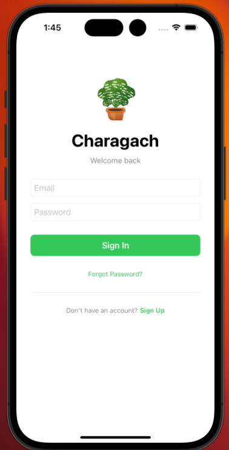 Login Screen</td>
		<td align="center">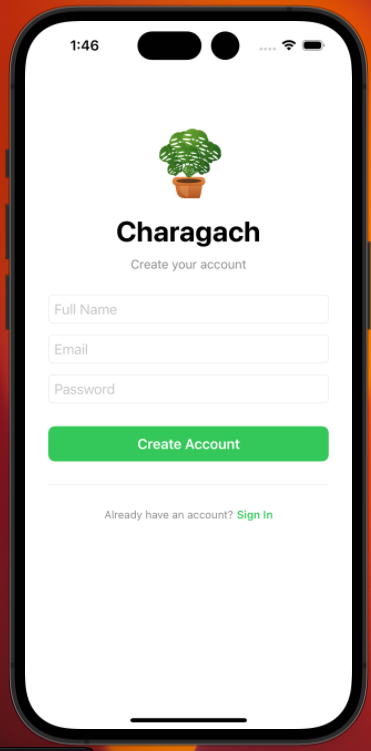 Sign Up Screen</td>
		<td align="center">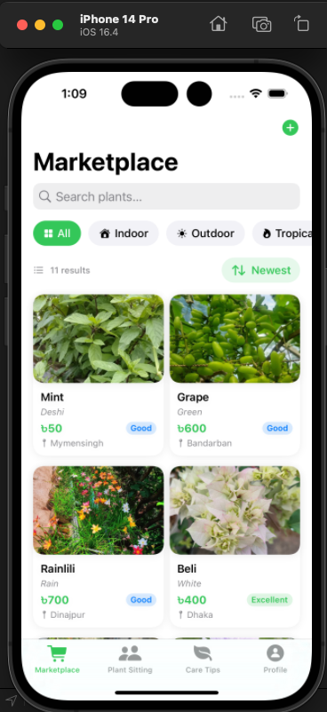 Marketplace Screen</td>
	</tr>
	<tr>
		<td align="center">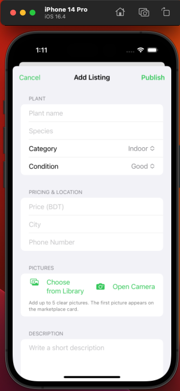 Add Listing Screen</td>
		<td align="center">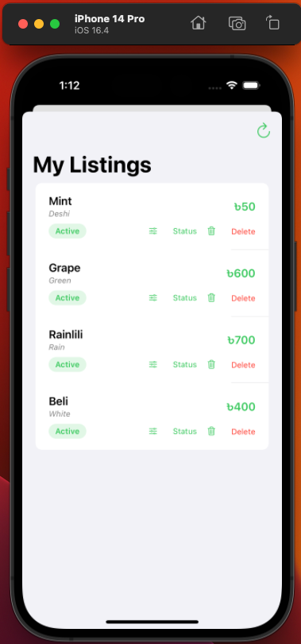 My Listings Screen</td>
		<td align="center">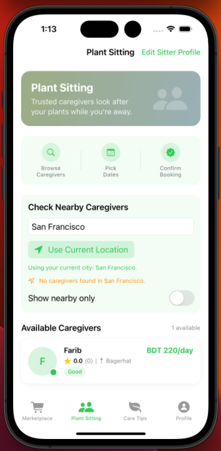 Plant Sitting Screen</td>
	</tr>
	<tr>
		<td align="center">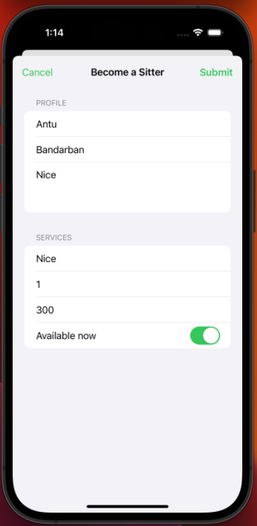 Become Sitter Screen</td>
		<td align="center">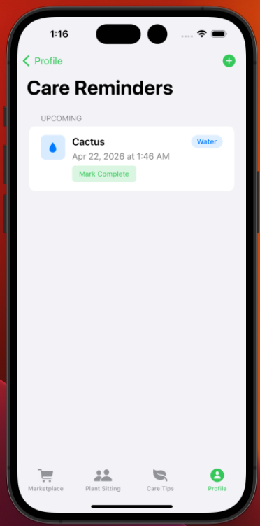 Care Reminder Screen</td>
		<td align="center">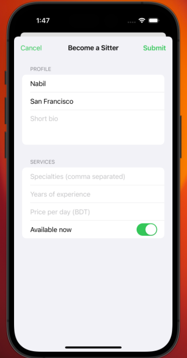 Caregiver Detail Screen</td>
	</tr>
	<tr>
		<td align="center">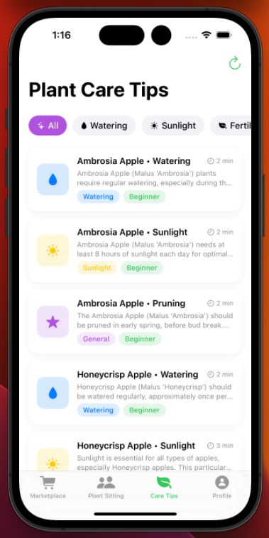 Plant Care Screen</td>
		<td align="center">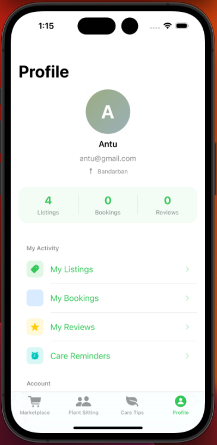 Profile Screen</td>
		<td align="center">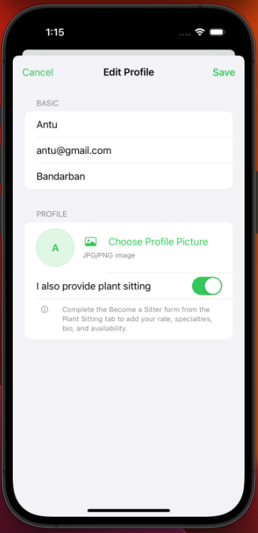 Edit Profile Screen</td>
	</tr>
</table>

## Conclusion
Charagach demonstrates a solid SwiftUI and Supabase architecture for a plant marketplace and care service app. The current version covers authentication, plant listing management, caregiver registration, profile editing, and plant care content. With booking persistence, messaging, dynamic content, and image upload improvements, it can become a more complete platform for plant lovers.